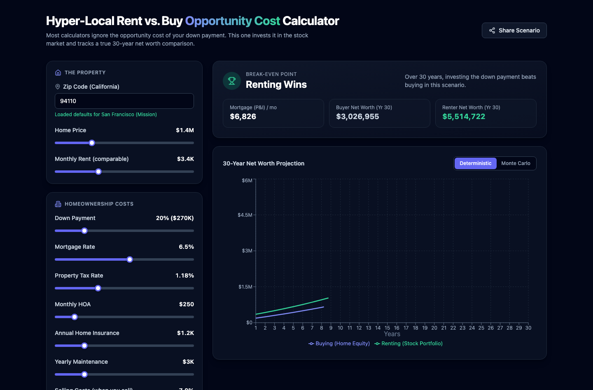
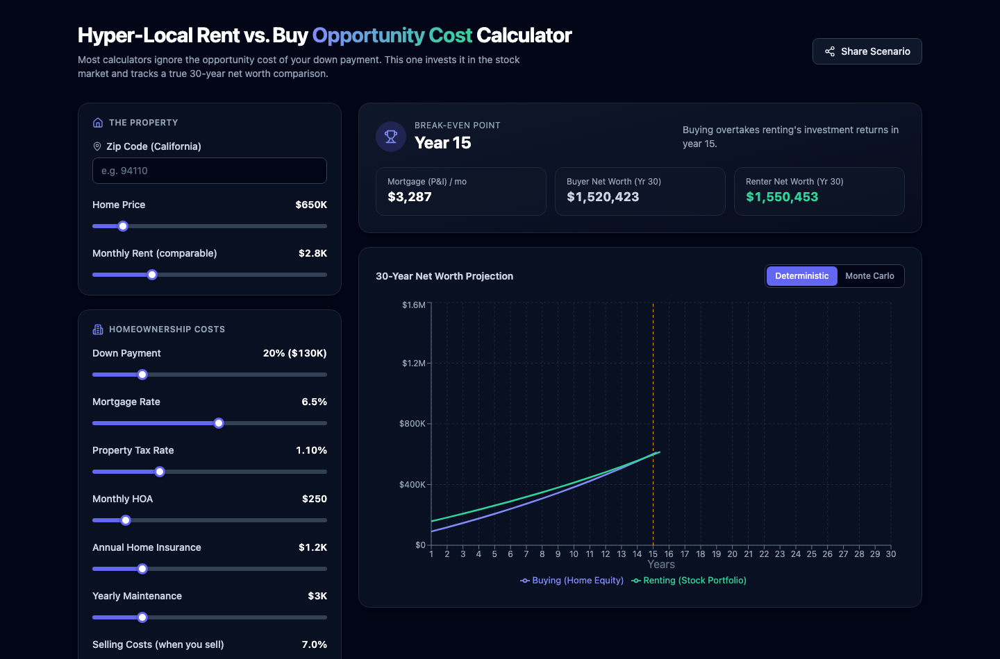
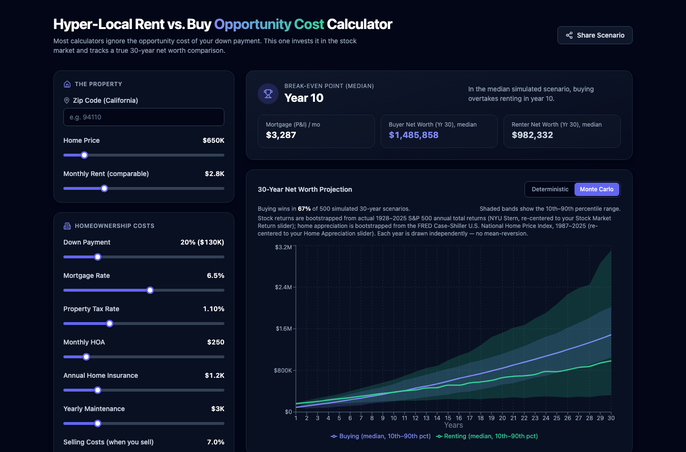

<!-- _class: lead -->

# Hyper-Local Rent vs. Buy
## Opportunity Cost Calculator

A rent-vs-buy calculator that doesn't ignore what your down payment could have earned you elsewhere.

**Live now:** onevvish.github.io/rentVsbuy

---

## The Problem

Every rent-vs-buy calculator online asks the same lopsided question:

> "Is your monthly mortgage payment more or less than rent?"

That's the wrong comparison. It ignores the single biggest number in the decision:

**What if you invested your down payment instead of locking it into a house?**

A $130K down payment invested in the market for 30 years can be worth **over a million dollars** on its own — most calculators pretend that opportunity doesn't exist.

---

## The Solution

A calculator that runs the comparison honestly:

- **Buyer** — builds home equity, pays the mortgage, taxes, insurance, maintenance
- **Renter** — invests the down payment *and* whatever they save each month vs. the buyer's costs

Every dollar of "if you didn't buy, where would that money go?" is tracked, for 30 years, side by side.

---

## Hyper-Local to California

Type a zip code, get real defaults for that market instantly:

- Home price & comparable rent
- Local property tax rate
- 35+ major CA metros mapped exactly; every other CA zip falls back to a regional estimate

---

## One Clear Answer: When Does Buying Win?

- **Break-even year** — the year buying's net worth overtakes renting's
- Full 30-year net worth chart for both paths
- Real costs modeled: mortgage, property tax, insurance, maintenance, selling costs

---

## Beyond a Single Guess: Monte Carlo Risk

Markets don't move in a straight line. Toggle to see a **range of outcomes**, not just one:

- Stock returns bootstrapped from real **1928–2025 S&P 500** history
- Home appreciation bootstrapped from the real **FRED Case-Shiller index**
- 500 simulated 30-year scenarios → "buying wins in 67% of outcomes"

---

## Full Tax Picture, Not Just the Basics

Most calculators stop at property tax. This one models what actually shows up on a tax return:

| Feature | What it captures |
|---|---|
| **Prop 13 cap** | CA property tax assessment capped at 2%/year growth |
| **Itemized deductions** | Mortgage interest + property tax vs. standard deduction |
| **Section 121 exclusion** | Home-sale gains tax-free up to $250K / $500K |
| **Capital gains tax** | On the renter's investment gains, federal + state |

---

## Share Any Scenario Instantly

One click encodes every input — home price, rates, tax settings, chart tab — into a link.

**Send someone your exact numbers.** No accounts, no saving, no re-entering data.

---

## Try It Right Now

# **onevvish.github.io/rentVsbuy**

Free. No sign-up. Live on GitHub Pages, auto-deployed on every update.

---

## What's Next

- Expand hyper-local defaults beyond California
- Model PMI for buyers under 20% down
- CA rent-control caps (AB 1482) on the Rent Inflation assumption
- Upfront closing costs as part of the renter's invested capital

---

<!-- _class: lead -->

# Questions?

**onevvish.github.io/rentVsbuy**
github.com/OneVVish/rentVsbuy
